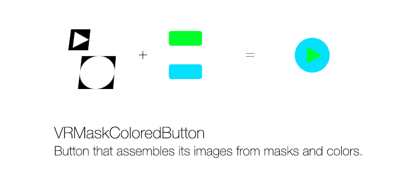

VRMaskColoredButton
===================

[](https://travis-ci.org/IvanRublev/VRMaskColoredButton)
[](http://cocoapods.org/pods/VRMaskColoredButton)
[](http://cocoapods.org/pods/VRMaskColoredButton)
[](http://cocoapods.org/pods/VRMaskColoredButton)

This is a UIButton class descendant that allows you to set the shape and the color of the button's images independently. Works better with flat designs.

Define button's image and background image shapes via grayscale images. Set the color for necessary UIControlState-s. Then the button control makes colored images for every state by combining grayscale mask images and colors are set.

Use the vector pdf assets as mask images in your project. It makes XCode produce necessary images for all device display resolutions during compile time. This way you can have two or even one image files per button in the project.

The VRMaskColoredButton is fully configurable through Interface Builder.


Installation
------------

VRMaskColoredButton is available through [CocoaPods](http://cocoapods.org). To install
it, simply add the following line to your Podfile:

```ruby
pod "VRMaskColoredButton"
```


Usage
-----

The VRMaskColoredButton can be used with storyboards or via code-only. Here are the common steps:

Prepare masks for image and background image as vector assets. Those should be pdfs made for @1x resolution with following general characteristics:

* Resolution: 72 pixels/inch.
* Layers enabled.
* PDF Compatability: Acrobat 8 (PDF 1.7)

Add prepared images to assets catalog in your project. For details see [this article](http://useyourloaf.com/blog/creating-scaled-images-with-pdf-vectors.html).

### With Storyboard

1. Open the storyboard and add a Button control to desired view. Select the added button, open Identity Inspector and set `VRMaskColoredButton` value for the Class field and same value for the Module field in Custom Class section.

2. Open Attributes Inspector and change Button Type to Custom.

3. Set the Image and Background attributes under Button section to mask assets added before.  

4. Set the Normal Color and Normal Background Color attributes under Mask Colored Button section to colors you want. 

	The button will be shown with images painted with selected colors.

You can change the Highlighted, Selected or Selected+Highlighted color attributes if you need. There are Selected+Highlighted Image and Background Image attributes available to set images for that state. 

### Via code

Swift: 

```swift
let button = VRMaskColoredButton(frame: CGRectMake(0, 0, 44, 44))
button.setImage(UIImage(named: "btn_image"), forState: .Normal)
button.setBackgroundImage(UIImage(named: "btn_background_image"), forState: .Normal)
button.setImageColor(UIColor(red: 0, green: 1.0, blue: 44/255.0, alpha: 1.0), forState: .Normal)
button.setBackgroundImageColor(UIColor(red: 5/255.0, green: 224/255.0, blue: 1.0, alpha: 1.0), forState: .Normal)
```

Objective-C:

```objc
VRMaskColoredButton *button = [[VRMaskColoredButton alloc] initWithFrame:CGRectMake(0, 0, 44, 44)];
[button setImage:[UIImage imageNamed:@"btn_image"] forState:UIControlStateNormal];
[button setBackgroundImage:[UIImage imageNamed:@"btn_background_image"] forState:UIControlStateNormal];
[button setImageColor:[UIColor colorWithRed:0 green:1.0 blue:44/255.0 alpha:1.0] forState:UIControlStateNormal];
[button setBackgroundImageColor:[UIColor colorWithRed:5/255.0 green:224/255.0 blue:1.0 alpha:1.0] forState:UIControlStateNormal];
```

For further details see the example project.


UIImage extension
-----------------

Besides the button class you can use `imageByApplyingColor` function on `UIImage` mask object to apply colors to it. You can specify background color or background image to fill the background of the mask. If you don't specify background parameter value it will be a clear color.

```swift
let maskImage = UIImage(named: "btn_image")!
let assembledImage0 = maskImage.imageByApplyingColor(UIColor.greenColor())
let assembledImage1 = maskImage.imageByApplyingColor(UIColor.greenColor(), backgroundColor: UIColor.blueColor())
let assembledImage2 = maskImage.imageByApplyingColor(UIColor.greenColor(), mergeWithBackgroundImage: UIImage(named: "complicated_background_image"))
```


Requirements
------------

* iOS 8.0 or later.
* XCode 7 or later.


Author
------

Ivan Rublev, ivan@ivanrublev.me


License
-------

VRMaskColoredButton is available under the MIT license. See the LICENSE file for more info.
